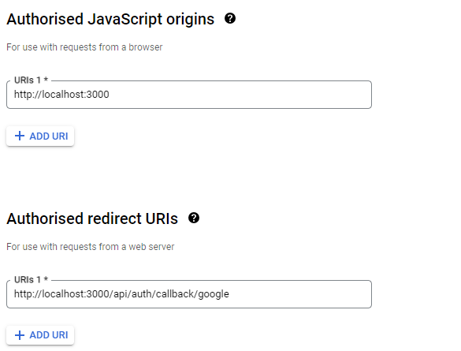

This is a [Next.js](https://nextjs.org/) project bootstrapped with [`create-next-app`](https://github.com/vercel/next.js/tree/canary/packages/create-next-app).

## Getting Started

First, run the development server:

```bash
npm run dev
# or
yarn dev
# or
pnpm dev
# or
bun dev
```

Open [http://localhost:3000](http://localhost:3000) with your browser to see the result.

You can start editing the page by modifying `app/page.tsx`. The page auto-updates as you edit the file.

This project uses [`next/font`](https://nextjs.org/docs/basic-features/font-optimization) to automatically optimize and load Inter, a custom Google Font.

## Learn More

To learn more about Next.js, take a look at the following resources:

- [Next.js Documentation](https://nextjs.org/docs) - learn about Next.js features and API.
- [Learn Next.js](https://nextjs.org/learn) - an interactive Next.js tutorial.

You can check out [the Next.js GitHub repository](https://github.com/vercel/next.js/) - your feedback and contributions are welcome!

## Deploy on Vercel

The easiest way to deploy your Next.js app is to use the [Vercel Platform](https://vercel.com/new?utm_medium=default-template&filter=next.js&utm_source=create-next-app&utm_campaign=create-next-app-readme) from the creators of Next.js.

Check out our [Next.js deployment documentation](https://nextjs.org/docs/deployment) for more details.

# My Notes

## Catch all routes

- If we want to add a single route handler for
  `/api/auth/user`
  `/api/auth/random`
  `/api/auth/123`
  `/api/auth/...`

- We can create a `catch all` route

### 1. Create `app/api/auth/[...nextauth]/route.ts`

- General solutions

```
import { NextRequest, NextResponse } from "next/server"

export function GET(req: NextRequest) {
    return NextResponse.json({
        message: "Handler"
    })
}
```

### 2. Try going to a few endpoints

```
http://localhost:3000/api/auth/signin
http://localhost:3000/api/auth/123
http://localhost:3000/api/auth/random/random2
```

### 3. Try logging the sub-route you’re at

```
export function GET(req: NextRequest, {params} : { params: { nextAuth: string[]}}) {
    // console.log(params);            // { nextAuth: [ 'sign', 'fd' ] }
    // console.log(req)         // all details
    console.log(params.nextAuth);       //  [ 'sign', 'fd' ]
    console.log(params.nextAuth[0]);       //  sign


    return NextResponse.json({
        msg: "Dynamic routing"
    })
}
```

## Give NextAuth access to a catch-all

- https://next-auth.js.org/configuration/initialization#route-handlers-app

### 1. Install `next-auth`

```
yarn add next-auth
```

### 2. Update `app/api/auth/[...nextauth]/route.ts`

- it should be `[...nextauth]` - case sensitive

```
const handler = () => {

   // LOGIC GOES HERE...
}

// export const GET = handler
// export const POST = handler
// In one line
export {handler as GET, handler as POST}
```

### 3. Adding `providers` - There are three broad types of providers

- 1. OAuth (Login with google)
- 2. Email (Passwordless Email login via email OTP)
- 3. Credentials (your own strategy)

## Credentials provider

- Using own strategy
- For example
  - Email + Password
  - Phone number
  - Login with Metamask

### 1. Add a credentials provider - Update `handler` in `app/api/auth/[...nextauth]/route.ts`

```
const handler = NextAuth({
    providers: [
        CredentialsProvider({
            name: 'Email',
            credentials: {
                username: {
                    label: 'Email',
                    type: 'email',
                    placeholder: 'example@gmail.com'
                },
                password: {
                    label: 'Password',
                    type: 'password',
                    placeholder: "********"
                },
            },
            async authorize(credentials, req) {
                console.log(credentials);

                // return null;  // if credentials incorrect
                return {
                    id: "user1",
                    email: 'abc@gmail.com',
                    password: '123456'
                }
            },
        })
    ],
    secret: process.env.NEXTAUTH_SECRET
})
```

### 2. Update `App.tsx` to have a simple Appbar

- `nextauth` provides its own `signIn` and `signOut`

```
"use client"
import { signIn, signOut } from "next-auth/react";
import { useRouter } from "next/navigation";
export const Appbar = () => {
    const router = useRouter();

    return (
        <div>
            {/* general solution */}
            {/* <button onClick={() => {
                router.push('/api/auth/signin')
            }}>Signin</button>
            <button onClick={() => {}}>Logout</button> */}

            {/* using nextauth's signin and signout */}
            <button onClick={() => {
                signIn()
            }}>Signin</button>
            <button onClick={() => {
                signOut()
            }}>Logout</button>
        </div>
    )
}
```

### 3. Add `NEXTAUTH_URL` & `NEXTAUTH_SECRET` to `.env`

```
NEXTAUTH_URL=http://localhost:3000
NEXTAUTH_SECRET=password_nextauth
```

### 4. Add `providers.tsx` inside `app` folder

- This is requird for managing server session

```
"use clint"
import { SessionProvider } from 'next-auth/react'
import React from 'react'

export default function Providers({ children }: {
    children: React.ReactNode
}) {
    return (
        <SessionProvider>
            {children}
        </SessionProvider>
    )
}
```

### 5. Wrap `layout` with `Providers`

- update this

```
<body className={inter.className}>
    <Providers>
        {children}
    </Providers>
</body>
```

### 6. Get the user details in the top level `page.tsx` (client component)

```
"use client"
import { useSession } from 'next-auth/react'
import React from 'react'

export default function User() {
    const session = useSession();
    return (
        <div>
            {JSON.stringify(session)}
        </div>
    )
}
```

### 7. Get the user details on the server (server component) - `api/user/route.ts`

```
import { getServerSession } from "next-auth"
import { NextResponse } from "next/server";

export async function GET() {
    const session = await getServerSession();

    return NextResponse.json({
        name: session?.user?.name
    })
}
```

### 8. Get user in an api route (`/api/user`)

```
import { getServerSession } from "next-auth";
import { NextRequest, NextResponse } from "next/server";

export async function GET(req: NextRequest) {
    const session = await getServerSession();
    // console.log(session);

    return NextResponse.json({
        session
    })
}
```

### 9. Persist more data

```
callbacks: {
    jwt: async ({ user, token }: any) => {
        if (user) {
            token.uid = user.id;
        }
        return token;
    },
    session: ({ session, token, user }: any) => {
        if (session.user) {
            session.user.id = token.uid
        }
        return session
    }
},
```

#### 10. Move auth config to `app/lib/auth.ts` and import it inside `getServerSession`, `NextAuth`

- https://github.com/nextauthjs/next-auth/issues/7658#issuecomment-1683225019

```
import CredentialsProvider from "next-auth/providers/credentials";
export const NEXT_AUTH_CONFIG = {
    providers: [
        CredentialsProvider({
            name: 'Email',
            credentials: {
                ...
            },
            async authorize(credentials: any) {
                ...
            },
        })
    ],
    secret: process.env.NEXTAUTH_SECRET,
    callbacks: {
       ...
    }
}
```

```
const handler = NextAuth(NEXT_AUTH_CONFIG)
const session = await getServerSession(NEXT_AUTH_CONFIG);

```

## Adding Google Provider

https://next-auth.js.org/providers/google

- Go to https://console.developers.google.com/apis/credentials
- CREATE CREDENTIALS -> OAuth Client Id
- Fill some steps
  
- "Authorized redirect URIs"
  - For production: https://{YOUR_DOMAIN}/api/auth/callback/google
  - For development: http://localhost:3000/api/auth/callback/google
- After creating , add `GOOGLE_CLIENT_ID` & `GOOGLE_CLIENT_SECRET` in `.env`

  ```
  GOOGLE_CLIENT_ID=google_client_id
  GOOGLE_CLIENT_SECRET=google_client_secret
  ```

- Add google providers in `lib/auth.ts`

  ```
  import GoogleProvider from "next-auth/providers/google";
  ...
  providers: [
    GoogleProvider({
        clientId: process.env.GOOGLE_CLIENT_ID,
        clientSecret: process.env.GOOGLE_CLIENT_SECRET
    })
  ]
  ...
  ```

## Adding Github provider

- https://next-auth.js.org/providers/github

- visit https://github.com/settings/apps
- new github app -> set app name ->
- Homepage url -> `http://localhost:3000`
- Callback URL -> `http://localhost:3000/api/auth/callback/github`
- webhook -> `inactive`
- Copy `Client ID` & generate `new client secret `and paste it into `.env` file

  ```
  GITHUB_ID=Client_ID
  GITHUB_SECRET=Client_SECRET
  ```

- Add github providers in `lib/auth.ts`

  ```
  import GitHubProvider from "next-auth/providers/github";
  ...
  providers: [
      GitHubProvider({
          clientId: process.env.GITHUB_ID,
          clientSecret: process.env.GITHUB_SECRET
      })
  ]
  ...
  ```

## Custom Signin page

- create `app/signin/page.tsx`
- Inside this

```
<button onClick={async () => {
    await signIn("google")
}}>Login with google</button>
```

- we must provide `signIn('provider_name)` and must be added in `lib/auth.ts`

- Similarly for credentials,

```
const res = await signIn("credentials", {
    username: "",
    password: "",
    redirect: false,
});
```

- The main thing is add `pages` in `NEXT_AUTH_CONFIG`

```
pages: {
    signIn: '/signin',
}
```
