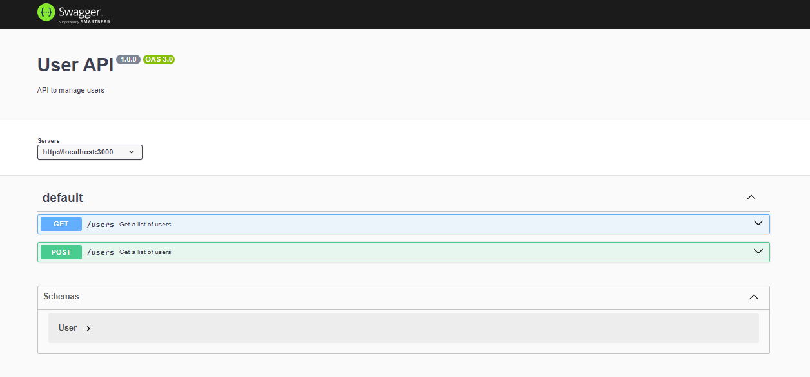

# Create auto-documentation

## Keep your `openapispec.yaml` code handy

```yaml
openapi: 3.0.0
info:
  title: User API
  description: API to manage users
  version: "1.0.0"
servers:
  - url: http://localhost:3000
paths:
  /users:
    get:
      summary: Get a list of users
      description: Retrieves a list of users, optionally filtered by name.
      parameters:
        - in: query
          name: name
          schema:
            type: string
          required: false
          description: Name filter for user lookup.
      responses:
        "200":
          description: A list of users
          content:
            application/json:
              schema:
                type: array
                items:
                  $ref: "#/components/schemas/User"
    post:
      summary: Get a list of users
      description: Retrieves a list of users, optionally filtered by name.
      parameters:
        - in: query
          name: name
          schema:
            type: string
          required: false
          description: Name filter for user lookup.
      responses:
        "200":
          description: A list of users
          content:
            application/json:
              schema:
                type: array
                items:
                  $ref: "#/components/schemas/User"
components:
  schemas:
    User:
      type: object
      properties:
        id:
          type: integer
          format: int64
          description: The unique identifier of the user.
        name:
          type: string
          description: The name of the user.
      required:
        - id
        - name
```

- Generate a json file from this yaml (https://onlineyamltools.com/convert-yaml-to-json)

- Create the `openapispec.ts` file with exporting the json data

```
export const openApiSpec = {
    "openapi": "3.0.0",
    ...
}
```

## Express setup

### 1. Install using npm

```
npm install swagger-ui-express @types/swagger-ui-express
```

### 2. Update the main index.ts file

```
import swaggerUi from 'swagger-ui-express';
import { openApiSpec } from './openapispec'; // from openapispec.ts - json data
```

### 3. Add middlware

```
app.use('/docs', swaggerUi.serve, swaggerUi.setup(openApiSpec))
```



## Ways to create a spec

- Write it by hand.
- Auto generate it from code
  - Easy in Rust but slightly harder in Go/Typescript.
  - Node.js has some libraries/codebases
  ```
  /* Update this one while you write the code and its job of developer who wrote code
  * GET
  * /users
  * Input: {
  *  path: {
  *      name: string
  *  }
  * }
  * Output: {
  *  200,
  *  ...
  * }
  */
  ```
- Another one is by using hono + zod + openAPI.
