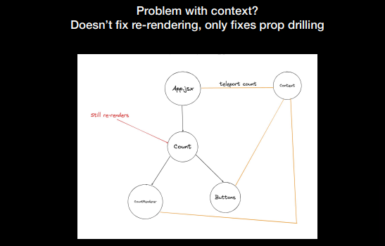

# Recoil
A state management library for React
Written by some ex React folks (I think)
Other popular ones -
1. Zustand
2. Redux

1. First create atom directory under /store
2. Define it [useRecoilState(countAtom), useRecoilValue(countAtom), useSetRecoilValue(countAtom)]

